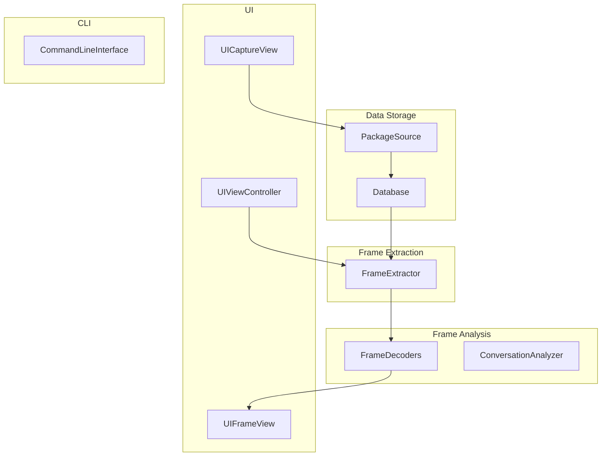
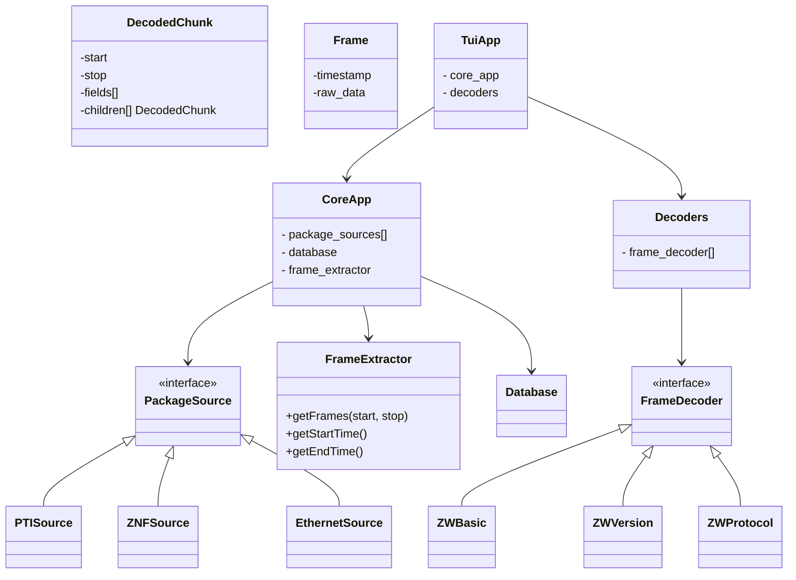

Zniffer-RS System Architecture
==============================

Overall Architecture of the rust zniffer Application

```mermaid
flowchart TB
    subgraph "Data Storage"
        Database[Database]
        PackageSource[PackageSource]
    end

    subgraph "Frame Analysis"
        FrameDecoders[FrameDecoders]
        ConversationAnalyzer[ConversationAnalyzer]
    end

    subgraph "UI"
        UIFrameView[UIFrameView]
        UICaptureView[UICaptureView]
        UIViewController[UIViewController]
    end

    subgraph "CLI"
        CommandLineInterface[CommandLineInterface]
    end

    subgraph "Frame Extraction"
        FrameExtractor[FrameExtractor]
    end

    PackageSource --> Database
    Database --> FrameExtractor
    FrameExtractor --> FrameDecoders
    FrameDecoders --> UIFrameView
    UICaptureView --> PackageSource
    UIViewController --> FrameExtractor
```

```mermaid
classDiagram
    class PackageSource {
        <<interface>>
    }

    class PTISource {
    }

    class ZNFSource {
    }

    class EthernetSource {
    }

    class FrameExtractor {
        +getFrames(start, stop)
        +getStartTime()
        +getEndTime()
    }

    class Database {
    }

    class DecodedChunk {
        -start
        -stop
        -fields[]
        -children[] DecodedChunk
    }

    class Frame {
        -timestamp
        -raw_data
    }

    class FrameDecoder {
        <<interface>>
    }

    class ZWBasic {
    }

    class ZWVersion {
    }

    class ZWProtocol {
    }

    class CoreApp {
        - package_sources[]
        - database
        - frame_extractor
    }

    class TuiApp {
        - core_app
        - decoders
    }

    class Decoders {
        - frame_decoder[]
    }


    CoreApp --> Database
    CoreApp --> PackageSource
    CoreApp --> FrameExtractor
    
    TuiApp --> CoreApp
    TuiApp --> Decoders

    Decoders --> FrameDecoder

    PackageSource <|-- PTISource
    PackageSource <|-- ZNFSource
    PackageSource <|-- EthernetSource

    FrameDecoder <|-- ZWBasic
    FrameDecoder <|-- ZWVersion
    FrameDecoder <|-- ZWProtocol
```