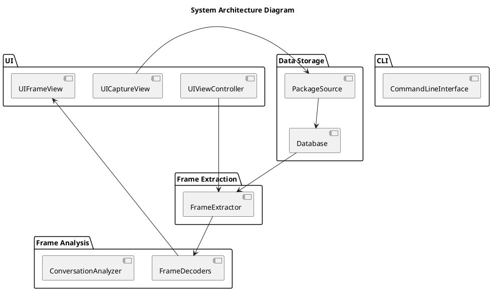

Zniffer-RS System Architecture
==============================

Overall Architecture of the rust zniffer Application




```plantuml

interface PackageSource {

}

class PTISource  {

}

class ZNFSource  {

}

class EthernetSource

class FrameExtractor {
    +getFrames(start,stop)
    +getStartTime()
    +getEndTime()
}

class Database


class DecodedChunk {
    - start
    - stop
    - fields[]
    - children[] : DecodedChunk
}

class Frame {
    - timestamp
    - raw_data
    - 
}

interface FrameDecoder {
    +is_my_frame()
    +consume(Frame)
}


FrameExtractor -- Database
PackageSource -- Database

PackageSource --|> PTISource
PackageSource --|> ZNFSource
PackageSource --|> EthernetSource


FrameDecoder --|> ZWBasic
FrameDecoder --|> ZWVersion
FrameDecoder --|> ZWProtocol

```